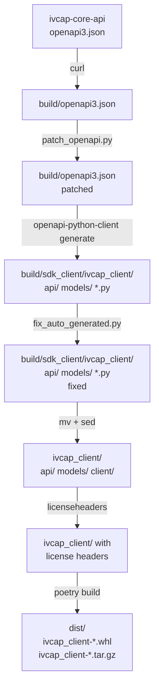

# Design Notes — ivcap-client-sdk-python

This document describes the architecture of the SDK build pipeline, the workarounds
required to bridge the gap between the upstream OpenAPI specification and the
generated Python client, and guidelines for maintaining them.

---

## Build Pipeline Overview

The SDK is **not hand-written**. The core `ivcap_client/api` and `ivcap_client/models`
packages are generated from the [ivcap-core-api](https://github.com/ivcap-works/ivcap-core-api)
OpenAPI 3 specification using [`openapi-python-client`](https://github.com/openapi-generators/openapi-python-client).
A thin set of hand-written modules (`ivcap_client/ivcap.py`, `ivcap_client/artifact.py`, etc.)
then wraps the generated layer with a higher-level, user-friendly API.



The full pipeline is driven by `make build` → `make gen` + `make add-license`.

---

## Step 1 — Download the OpenAPI Spec

```makefile
curl ${OPENAPI_URL} > openapi3.json
```

The spec is fetched from the `develop` branch of `ivcap-core-api` and written to
`build/openapi3.json`. This means the build always tracks the latest upstream API.

---

## Step 2 — Patch the OpenAPI Spec (`patch_openapi.py`)

**Script:** [`patch_openapi.py`](patch_openapi.py)

`openapi-python-client` is strict: it will skip any endpoint whose request body lacks
a `schema` field. The upstream spec has at least one such defect.

### Known patch: `POST /1/services2/{service_id}/jobs`

**Root cause:** The endpoint accepts an *arbitrary* JSON payload (the caller sends
whatever the target service expects), so the API designers left the request body
schema empty — only an `"example"` key is present:

```json
"requestBody": {
  "description": "Request to be sent to service",
  "required": true,
  "content": {
    "application/json": {
      "example": { "echo": "Hello World" }
    }
  }
}
```

Without a `schema`, `openapi-python-client` emits:

```
WARNING parsing POST /1/services2/{service_id}/jobs within service.
Endpoint will not be generated.
Missing schema
```

**Fix:** `patch_openapi.py` adds `"schema": {}` (an empty JSON Schema, which means
*any value*) to the `application/json` content block before generation:

```python
content["application/json"]["schema"] = {}
```

An empty schema (`{}`) is the correct OpenAPI representation for a free-form JSON
body — it validates any JSON value while being transparent to callers.

### Adding future patches

Add new patches as additional `try/except KeyError` blocks inside `patch_openapi.py`,
following the same pattern. Each patch should include a comment explaining:

1. Which endpoint/field is affected
2. Why the upstream spec is missing/wrong
3. What value is injected and why it is semantically correct

---

## Step 3 — Generate the Client (`openapi-python-client`)

```bash
poetry run openapi-python-client generate \
    --path openapi3.json \
    --config config.yml
```

**Config** ([`config.yml`](config.yml)):

```yaml
project_name_override: sdk_client
package_name_override: ivcap_client
content_type_overrides:
  application/datalog+mangle: application/octet-stream
```

- `project_name_override` / `package_name_override` — keep the output package name
  stable regardless of the spec's `info.title`.
- `content_type_overrides` — maps the non-standard `application/datalog+mangle`
  media type to `application/octet-stream` so the generator can handle it.

Output lands in `build/sdk_client/ivcap_client/`.

---

## Step 4 — Fix the Generated Code (`fix_auto_generated.py`)

**Script:** [`fix_auto_generated.py`](fix_auto_generated.py)

`openapi-python-client` has a known quirk: when a request/response body has type
`string` with `format: binary`, it generates code that wraps the value in a `File`
object (from `httpx`). This is not usable for the IVCAP use cases where those fields
carry raw bytes or plain Python dicts — not `httpx.File` tuples.

The script performs two categories of fixes **in-place** on the generated source in
`build/sdk_client/`:

### 4a — API file renaming + `json_body: File → Dict` fixup

`openapi-python-client` generates API files named after their operation, but without
the service-directory prefix, which causes import collisions when multiple services
share an operation name (e.g. `list.py` exists in `artifact/`, `order/`, `service/`,
etc.). The script renames each file to `{service}_{operation}.py`:

```python
orig = f"{root}/{el}"            # e.g. build/.../api/artifact/list.py
newn = f"{root}/{svc}_{el[...]}" # e.g. build/.../api/artifact/artifact_list.py
fix_file(orig, newn, fix_api)
```

At the same time, `fix_api` rewrites `json_body` parameter types from `File` to
`Dict` in every API function:

| Generated (wrong) | Fixed |
|---|---|
| `json_body: File` | `json_body: Dict` |
| `json_json_body = json_body.to_tuple()` | `json_json_body = json_body` |
| `json_body (File):` (docstring) | `json_body (Dict):` |

### 4b — Model-level fixes

Three model files receive targeted line-level substitutions via `fix_model()`:

#### `search_list_rt.py`

The `items` list contains elements typed as `File(payload=BytesIO(...))`. The actual
search result items are plain Python objects — the `File` wrapping is discarded:

| Generated | Fixed |
|---|---|
| `items_item = File(payload=BytesIO(items_item_data))` | `items_item = items_item_data` |

#### `service_status_rt.py`

The `controller` field is typed as `File`. It carries a plain value (e.g. a URL
string), not binary data:

| Generated | Fixed |
|---|---|
| `controller = File(payload=BytesIO(d.pop("controller")))` | `controller = d.pop("controller")` |
| `controller = self.controller.to_tuple()` | `controller = self.controller` |

#### `job_status_rt.py`

Both `request_content` and `result_content` are typed as `File` / `FileJsonType`.
These fields hold arbitrary JSON (the job's input/output payloads), so they are
retyped to `Any`:

| Generated | Fixed |
|---|---|
| `request_content: Union[Unset, File]` | `request_content: Union[Unset, Any]` |
| `request_content = File(payload=BytesIO(_request_content))` | `request_content = _request_content` |
| `request_content: Union[Unset, FileJsonType] = UNSET` | `request_content: Union[Unset, Any] = UNSET` |
| `request_content = self.request_content.to_tuple()` | `request_content = self.request_content` |
| *(same for `result_content`)* | |

---

## Step 5 — File Layout Reorganisation

After generation and fixing, the build copies files into the final source tree:

```bash
mv build/sdk_client/ivcap_client/*  ivcap_client/
mv ivcap_client/client/errors.py    ivcap_client/
mv ivcap_client/client/types.py     ivcap_client/
```

`errors.py` and `types.py` are moved up one level (out of `client/`) because they
are shared across the whole package. A `DO NOT EDIT` banner is prepended to both
via `sed` so that contributors know they are auto-generated:

```bash
sed -i '' '1s/^/#\n#### DO NOT EDIT ####\n#\n/' ivcap_client/types.py ivcap_client/errors.py
```

---

## Step 6 — License Headers (`licenseheaders`)

```bash
poetry run licenseheaders -t .license.tmpl -y 2023-$(date +%Y) -f ivcap_client/*.py
poetry run licenseheaders -t .license.tmpl -y 2023-$(date +%Y) -d ivcap_client/client
```

`licenseheaders` prepends the project's license boilerplate (defined in
[`.license.tmpl`](.license.tmpl)) to every `.py` file in `ivcap_client/`. The year
range is always updated to the current year at build time.

> **Note:** `licenseheaders` must be invoked via `poetry run` — it is a project dev
> dependency and is not installed globally.

---

## Maintenance Guidelines

### When the upstream spec changes

Run `make build`. If new warnings appear from `openapi-python-client`, check whether:

- A new endpoint is missing a `schema` → add a patch block in `patch_openapi.py`.
- A new model uses `File` / `FileJsonType` incorrectly → add a `fix_model()` call in
  `fix_auto_generated.py`.

### When `openapi-python-client` is upgraded

The generator's code-generation behaviour may change between versions. After
upgrading:

1. Run `make gen` and inspect the diff in `ivcap_client/`.
2. Check whether the `fix_api` string replacements in `fix_auto_generated.py` are
   still matching (the generated patterns may have changed).
3. Check whether any previously-skipped endpoints are now generated (or vice versa).

### Hand-written modules

The following files are **not** auto-generated and must not be deleted by `make gen`:

| File | Purpose |
|---|---|
| `ivcap_client/ivcap.py` | Top-level `IVCAP` client class |
| `ivcap_client/artifact.py` | High-level artifact upload/download helpers |
| `ivcap_client/aspect.py` | Aspect (metadata) helpers |
| `ivcap_client/job.py` | Job polling and result helpers |
| `ivcap_client/order.py` | Order management helpers |
| `ivcap_client/secret.py` | Secret management helpers |
| `ivcap_client/service.py` | Service query helpers |
| `ivcap_client/agent.py` | Agent / tool-call helpers |
| `ivcap_client/utils.py` | Shared utilities |
| `ivcap_client/exception.py` | Custom exception types |
| `ivcap_client/__init__.py` | Public API surface |

These are preserved across `make gen` runs because the Makefile only removes and
recreates the `api/`, `models/`, and `client/` subdirectories.
