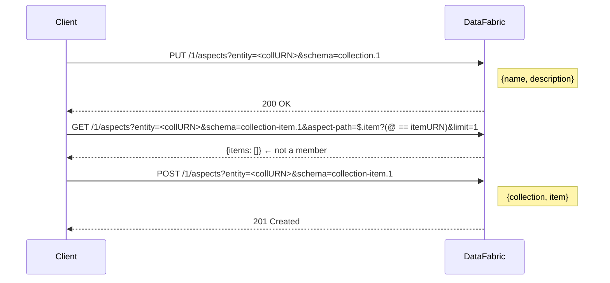

# Collections

This guide explains how to create and manage **collections** — named, described
groupings of entities — using the IVCAP Python SDK.

## What is a Collection?

A **collection** is a virtual resource that groups any set of IVCAP entity URNs
(most commonly artifacts) under a human-readable name and optional description.

Collections are implemented entirely through the **DataFabric aspect store** — there
is no separate REST endpoint. Two aspect schemas govern the feature:

| Schema URN | Purpose |
|---|---|
| `urn:ivcap:schema:collection.1` | Collection definition (name + description) |
| `urn:ivcap:schema:collection-item.1` | One membership record per item |

Both aspect types are attached to the **collection entity URN** — i.e. the URN you
choose to represent the collection is used as the `entity` field for all aspect
operations.

## Creating a Collection

```python
from ivcap_client import IVCAP

ivcap = IVCAP()

coll = ivcap.create_collection(
    "urn:ivcap:collection:my-ocean-survey",
    name="Ocean CTD Survey",
    description="CTD casts from voyage V2025-03",
)
print(coll)  # <Collection urn='urn:ivcap:collection:my-ocean-survey', name='Ocean CTD Survey'>
```

`create_collection` uses a DataFabric **PUT** (idempotent update), so calling it
again on an existing URN simply replaces the name/description without touching
the membership records.

!!! tip "Collection URN format"
    The collection URN must be a valid IVCAP URN. A common pattern is
    `urn:ivcap:collection:<uuid>` — use `uuid.uuid4()` to generate a fresh one.

## Adding Items

### Add a single URN

```python
item = coll.add_item("urn:ivcap:artifact:22222222-...")
if item is None:
    print("Already a member — skipped")
else:
    print(f"Added, membership aspect id: {item.id}")
```

Each call performs a **deduplication check** (a server-side JSONPath filter) before
creating the membership aspect with `POST`.  If the item is already a member,
`add_item` returns `None` silently.

### Add using the top-level client

```python
ivcap.add_to_collection(
    "urn:ivcap:collection:my-ocean-survey",
    "urn:ivcap:artifact:33333333-...",
)
```

## Listing Items in a Collection

```python
for ci in coll.items(limit=50):
    print(ci.item, ci.collection)
```

`items()` returns a paginated iterator of [`CollectionItem`](../api/collection.md)
records.

## Listing All Collections

```python
for c in ivcap.list_collections(limit=10):
    print(c.urn, c.name, c.description)
```

### Filter by name (JSONPath expression)

```python
# Exact match
for c in ivcap.list_collections(name_filter='== "Ocean CTD Survey"'):
    print(c.urn)

# Prefix match
for c in ivcap.list_collections(name_filter='starts with "Ocean"'):
    print(c.urn)

# Case-insensitive regex
for c in ivcap.list_collections(name_filter='like_regex ".*ocean.*" flag "i"'):
    print(c.urn)
```

The `name_filter` expression is wrapped as `$.name ? (@ <expr>)` before being
sent to the server as a PostgreSQL JSONPath `content_path` filter.

## Fetching a Collection by URN

```python
coll = ivcap.get_collection("urn:ivcap:collection:my-ocean-survey")
print(coll.name, coll.description)
print(coll.asserter, coll.valid_from)
```

Raises `ResourceNotFound` if the collection does not exist.

### Historical snapshot

```python
from datetime import datetime, timezone

past = datetime(2025, 1, 1, tzinfo=timezone.utc)
coll = ivcap.get_collection("urn:ivcap:collection:...", at_time=past)
```

## Removing Items

Remove a single item by retracting its membership aspect:

```python
was_removed = coll.remove_item("urn:ivcap:artifact:22222222-...")
print(was_removed)  # True if retracted, False if it was not a member
```

Items that are not currently members are **silently skipped** (returns `False`).

### Via the top-level client

```python
ivcap.remove_from_collection(
    "urn:ivcap:collection:my-ocean-survey",
    "urn:ivcap:artifact:22222222-...",
)
```

## Retracting an Entire Collection

Retract all membership records and then the definition itself:

```python
total = coll.retract()
print(f"Retracted {total} aspect records")  # items + 1 definition
```

Or equivalently:

```python
total = ivcap.retract_collection("urn:ivcap:collection:my-ocean-survey")
```

!!! warning "This operation cannot be undone"
    Like all DataFabric operations, retraction leaves inactive records behind
    (the store is append-only).  The collection simply becomes invisible to
    normal queries.  Items *can* be re-added later by calling `add_item` or
    `add_to_collection` again.

## Data Model



## Refreshing a Collection Object

If the definition has changed server-side, reload it in-place:

```python
coll.refresh()
print(coll.name)  # updated
```

## See Also

- [Working with Artifacts](artifacts.md) — Upload files and manage binary data
- [The Datafabric & Aspects](aspects.md) — How aspects work under the hood
- [API Reference: Collection](../api/collection.md) — Full class and function docs
- [Examples: Collections](../examples/collections.md) — Ready-to-run scripts
