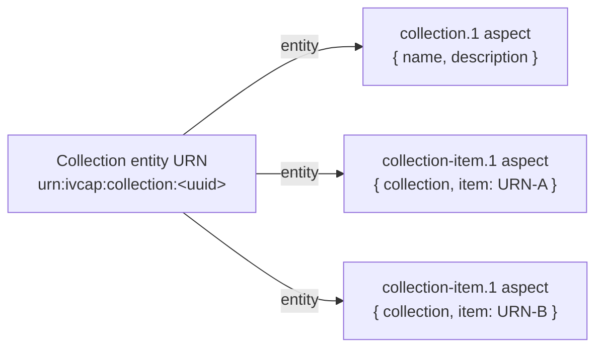
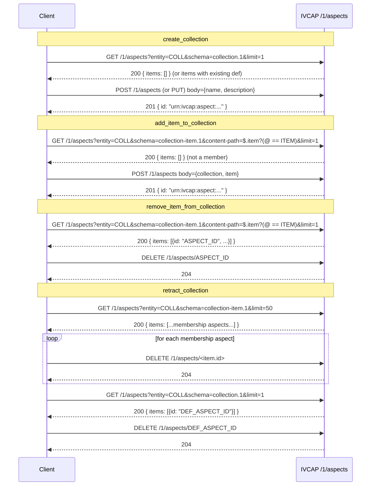

# Collections — Implementation Guide

> **Audience:** SDK implementors porting the IVCAP collection/item feature to a different language.
> This document describes the semantics, REST calls, and behavioural contracts that the Python SDK implements.

---

## 1. Concept Overview

A **collection** is a named, described grouping of entities (typically artifact URNs, but any valid IVCAP URN is accepted).

Collections are **not** a first-class REST resource.  There is **no** dedicated `/collections` endpoint.
Instead, the feature is implemented entirely on top of the **DataFabric aspect store** (`/1/aspects`).
Two well-known schemas govern the feature:

| Schema URN | Purpose |
|---|---|
| `urn:ivcap:schema:collection.1` | Collection **definition** (name + optional description) |
| `urn:ivcap:schema:collection-item.1` | Membership **record** — one aspect per item |

Both schema types are attached to the **same entity URN** — the URN the client chose to identify the collection (e.g. `urn:ivcap:collection:<uuid>`).



### DataFabric semantics

The aspect store is **append-only with temporal versioning**:

- `POST /1/aspects` — create a **new** aspect record (multiple records with the same `entity+schema` are allowed — used for membership records).
- `PUT /1/aspects` — **replace** the most-recent active aspect for a given `entity+schema` pair (used to update the collection definition).
- `DELETE /1/aspects/<id>` — **retract** a specific aspect record (marks it inactive; the record is never deleted).
- `GET /1/aspects` — list aspects, filterable by `entity`, `schema`, `content-path` (JSONPath), `at-time`, `limit`, `page`.

---

## 2. Data Models

### 2.1 Collection definition aspect body

Stored as the body of a `urn:ivcap:schema:collection.1` aspect attached to the collection entity URN.

```json
{
  "$schema": "urn:ivcap:schema:collection.1",
  "$entity": "urn:ivcap:collection:<uuid>",
  "name": "Ocean CTD Survey",
  "description": "CTD casts from voyage V2025-03"
}
```

| Field | Type | Required | Notes |
|---|---|---|---|
| `$schema` | string (URN) | yes | Always `urn:ivcap:schema:collection.1` |
| `$entity` | string (URN) | yes | The collection entity URN |
| `name` | string | yes | Human-readable name |
| `description` | string | no | Optional free-text description |

### 2.2 Collection-item membership aspect body

Stored as the body of a `urn:ivcap:schema:collection-item.1` aspect, also attached to the collection entity URN.

```json
{
  "$schema": "urn:ivcap:schema:collection-item.1",
  "$entity": "urn:ivcap:collection:<uuid>",
  "collection": "urn:ivcap:collection:<uuid>",
  "item": "urn:ivcap:artifact:<item-uuid>"
}
```

| Field | Type | Required | Notes |
|---|---|---|---|
| `$schema` | string (URN) | yes | Always `urn:ivcap:schema:collection-item.1` |
| `$entity` | string (URN) | yes | The **collection** entity URN (not the item URN) |
| `collection` | string (URN) | yes | Same as `$entity` — the collection the item belongs to |
| `item` | string (URN) | yes | URN of the entity being added as a member |

### 2.3 AspectListItemRT — aspect list response item

The `GET /1/aspects` endpoint returns a list of items.  The fields used by the collection feature are:

| Field | Type | Notes |
|---|---|---|
| `id` | string (URN) | Aspect record URN — needed for `DELETE /1/aspects/<id>` |
| `entity` | string (URN) | The entity the aspect is attached to |
| `schema` | string (URN) | The aspect schema URN |
| `content` | object | Aspect body (present when `include-content=true`) |
| `valid_from` | datetime | When this record became active |
| `valid_to` | datetime \| null | When this record was retracted (`null` = still active) |

Pagination is handled via a `links` field on the response.  The `next` link (if present) carries the `page` cursor for the next request.

---

## 3. API Operations

All calls go to the single aspects endpoint: **`/1/aspects`** (list/create) or **`/1/aspects/<id>`** (read/update/retract).

### 3.1 List aspects

```
GET /1/aspects
```

Query parameters used by the collection feature:

| Parameter | Type | Description |
|---|---|---|
| `entity` | string | Filter by entity URN |
| `schema` | string | Filter by schema URN (exact match or prefix with `%`) |
| `content-path` | string | JSONPath filter expression applied to aspect body |
| `at-time` | ISO 8601 datetime | Return aspects that were active at this timestamp |
| `limit` | int | Maximum number of results (default 10) |
| `page` | string | Opaque pagination cursor |
| `include-content` | bool | When `true`, include aspect body in each item |

Response (200 OK):
```json
{
  "items": [ /* AspectListItemRT[] */ ],
  "links": { "next": "<cursor>", "self": "..." }
}
```

### 3.2 Create aspect (POST)

```
POST /1/aspects
```

Headers: `Content-Type: application/json`

Query parameters:
- `entity` — entity URN
- `schema` — schema URN
- `policy` — (optional) access policy URN

Body: the aspect object (must include `$schema` and `$entity`).

Response: 201 Created with `AspectIDRT`:
```json
{ "id": "urn:ivcap:aspect:<uuid>" }
```

### 3.3 Update aspect (PUT)

```
PUT /1/aspects
```

Same headers, query parameters, and body shape as POST.
Semantics: retracts the currently active aspect for this `entity+schema` pair and creates a new one atomically.

Response: 200 OK with `AspectIDRT`.

### 3.4 Retract aspect (DELETE)

```
DELETE /1/aspects/<aspect-id>
```

Response: 204 No Content on success.

---

## 4. Operation Specifications

The following pseudo-code describes each operation in language-agnostic terms.

### 4.1 `create_collection(urn, name, description?, policy?)`

Create or idempotently update a collection definition.

**Why check first?**
Some IVCAP deployments reject a bare `PUT` for an entity that has no existing aspects ("not authorised for method 'add'").  The check-then-create/update pattern avoids this.

```
function create_collection(urn, name, description, policy):
    validate: urn must be non-empty
    validate: name must be non-empty

    # Step 1 — check whether a definition already exists
    response = GET /1/aspects
        entity        = urn
        schema        = "urn:ivcap:schema:collection.1"
        include-content = false
        limit         = 1

    if response.items is non-empty:
        is_update = true   # entity already has a definition → PUT
    else:
        is_update = false  # brand-new collection → POST

    # Step 2 — create or update the definition
    body = {
        "$schema": "urn:ivcap:schema:collection.1",
        "$entity": urn,
        "name": name
    }
    if description is provided:
        body["description"] = description

    if is_update:
        PUT /1/aspects?entity=urn&schema=urn:ivcap:schema:collection.1[&policy=...]  body=body
    else:
        POST /1/aspects?entity=urn&schema=urn:ivcap:schema:collection.1[&policy=...] body=body

    return Collection(urn=urn, name=name, description=description)
```

### 4.2 `get_collection(urn, at_time?)`

Fetch a collection definition.

```
function get_collection(urn, at_time):
    response = GET /1/aspects
        entity          = urn
        schema          = "urn:ivcap:schema:collection.1"
        include-content = true
        limit           = 2         # 2 to detect unexpected duplicates
        [at-time        = at_time]  # omit if not provided

    if response.items is empty:
        raise ResourceNotFound(urn)

    item = response.items[0]
    return Collection(
        urn         = item.entity,
        name        = item.content["name"],
        description = item.content.get("description"),
        asserter    = item.additional_properties.get("asserter"),
        valid_from  = item.valid_from,
        valid_to    = item.valid_to,
    )
```

### 4.3 `list_collections(name_filter?, limit?, at_time?)`

Return a paginated iterator over all collection definitions.

```
function list_collections(name_filter, limit, at_time):
    content_path = UNSET
    if name_filter is provided:
        # name_filter is a JSONPath comparison operator expression,
        # e.g. '== "Ocean Survey"' or 'starts with "CTD"'
        content_path = '$.name ? (@ ' + name_filter + ')'

    # Paginate lazily — yield items across pages until limit reached
    # or no more pages
    page_cursor = UNSET
    items_yielded = 0

    while true:
        response = GET /1/aspects
            schema          = "urn:ivcap:schema:collection.1"
            include-content = true
            limit           = min(limit - items_yielded, page_size)
            [at-time        = at_time]
            [content-path   = content_path]
            [page           = page_cursor]

        for item in response.items:
            yield Collection from item
            items_yielded += 1
            if items_yielded >= limit: return

        if response.links.next is absent: return
        page_cursor = response.links.next
```

**Name filter examples:**

| `name_filter` argument | Resulting `content-path` |
|---|---|
| `'== "Ocean Survey"'` | `$.name ? (@ == "Ocean Survey")` |
| `'starts with "CTD"'` | `$.name ? (@ starts with "CTD")` |
| `'like_regex ".*ocean.*" flag "i"'` | `$.name ? (@ like_regex ".*ocean.*" flag "i")` |

### 4.4 `add_item_to_collection(collection_urn, item_urn, policy?)`

Add an item to a collection with automatic deduplication.

```
function add_item_to_collection(collection_urn, item_urn, policy):
    validate: collection_urn must be non-empty
    validate: item_urn must be non-empty

    # Step 1 — dedup check (best-effort)
    dedup_path = '$.item ? (@ == "' + item_urn + '")'
    dedup_response = GET /1/aspects
        entity          = collection_urn
        schema          = "urn:ivcap:schema:collection-item.1"
        content-path    = dedup_path
        include-content = false
        limit           = 1

    if dedup_response.status == 2xx AND dedup_response.items is non-empty:
        return null   # already a member — skip silently

    # NOTE: if the dedup check returns 4xx/5xx (e.g. content-path not
    # supported by this deployment), fall through to POST rather than
    # raising an error.  A duplicate membership aspect is harmless.

    # Step 2 — create the membership aspect (always POST — never PUT)
    body = {
        "$schema": "urn:ivcap:schema:collection-item.1",
        "$entity": collection_urn,
        "collection": collection_urn,
        "item": item_urn,
    }
    response = POST /1/aspects
        entity = collection_urn
        schema = "urn:ivcap:schema:collection-item.1"
        [policy = policy]
        body = body

    return CollectionItem(
        id         = response.id,
        collection = collection_urn,
        item       = item_urn,
    )
```

### 4.5 `remove_item_from_collection(collection_urn, item_urn)`

Remove an item from a collection by retracting its membership aspect.

```
function remove_item_from_collection(collection_urn, item_urn):
    validate: collection_urn must be non-empty
    validate: item_urn must be non-empty

    # Step 1 — find the active membership aspect for this item
    find_path = '$.item ? (@ == "' + item_urn + '")'
    find_response = GET /1/aspects
        entity          = collection_urn
        schema          = "urn:ivcap:schema:collection-item.1"
        content-path    = find_path
        include-content = false
        limit           = 1

    if find_response.items is empty:
        return false    # not a member — skip silently

    aspect_id = find_response.items[0].id

    # Step 2 — retract the membership aspect
    DELETE /1/aspects/<aspect_id>

    return true
```

### 4.6 `list_collection_items(collection_urn, limit?, at_time?)`

Return a paginated iterator over all items belonging to a collection.

```
function list_collection_items(collection_urn, limit, at_time):
    # Paginate lazily — same pattern as list_collections
    page_cursor = UNSET
    items_yielded = 0

    while true:
        response = GET /1/aspects
            entity          = collection_urn
            schema          = "urn:ivcap:schema:collection-item.1"
            include-content = true
            limit           = min(limit - items_yielded, page_size)
            [at-time        = at_time]
            [page           = page_cursor]

        for item in response.items:
            content = item.content or {}
            yield CollectionItem(
                id         = item.id,
                collection = content.get("collection") or item.entity,
                item       = content["item"],
                valid_from = item.valid_from,
                valid_to   = item.valid_to,
            )
            items_yielded += 1
            if items_yielded >= limit: return

        if response.links.next is absent: return
        page_cursor = response.links.next
```

### 4.7 `retract_collection(collection_urn)`

Fully retract a collection and all its membership records (two-phase).

```
function retract_collection(collection_urn):
    validate: collection_urn must be non-empty
    retracted = 0

    # Phase 1 — retract all collection-item.1 membership aspects (paginated)
    page_cursor = UNSET
    while true:
        response = GET /1/aspects
            entity          = collection_urn
            schema          = "urn:ivcap:schema:collection-item.1"
            include-content = false
            limit           = 50
            [page           = page_cursor]

        for item in response.items:
            DELETE /1/aspects/<item.id>
            retracted += 1

        if response.links.next is absent: break
        page_cursor = response.links.next

    # Phase 2 — retract the collection.1 definition aspect
    def_response = GET /1/aspects
        entity          = collection_urn
        schema          = "urn:ivcap:schema:collection.1"
        include-content = false
        limit           = 1

    if def_response.items is empty:
        raise ResourceNotFound(collection_urn)

    DELETE /1/aspects/<def_response.items[0].id>
    retracted += 1

    return retracted   # total aspect records retracted
```

---

## 5. Pagination

The aspect list endpoint uses **cursor-based pagination**:

```
GET /1/aspects?schema=urn:ivcap:schema:collection.1&limit=10
→ { "items": [...], "links": { "next": "<cursor>", "self": "..." } }

GET /1/aspects?schema=urn:ivcap:schema:collection.1&limit=10&page=<cursor>
→ next page ...
```

- The `links` object may be absent or `null` — treat as no further pages.
- `links.next` is an opaque string cursor; pass it verbatim as the `page` query parameter.
- When the `next` key is absent or `null`, there are no more pages.

---

## 6. Error Handling

| Situation | Recommended behaviour |
|---|---|
| `GET /1/aspects` returns empty items for `get_collection` | Raise / return `ResourceNotFound` |
| `GET /1/aspects` returns empty items for `remove_item_from_collection` | Return `false` (silent no-op) |
| Dedup check in `add_item_to_collection` returns 4xx/5xx | **Fall through to POST** — do not raise; the duplicate membership aspect is benign |
| Any other non-2xx response | Raise an appropriate HTTP / server error |
| `retract_collection` cannot find the definition aspect | Raise `ResourceNotFound` |

---

## 7. Complete Operation Call Reference

The table below summarises every HTTP call made by each SDK operation.



---

## 8. Suggested SDK Surface

A minimal SDK implementation should expose the following operations.  Method signatures are language-agnostic.

### 8.1 Client / top-level methods

```
create_collection(urn, name, description?, policy?) → Collection
get_collection(urn, at_time?) → Collection
list_collections(name_filter?, limit?, at_time?) → Iterator<Collection>
add_to_collection(collection_urn, item_urn, policy?) → CollectionItem | null
remove_from_collection(collection_urn, item_urn) → bool
retract_collection(collection_urn) → int
```

### 8.2 `Collection` object

```
urn         : string   // collection entity URN (aka id)
name        : string
description : string?
asserter    : string?
valid_from  : datetime?
valid_to    : datetime?  // null = still active

add_item(item_urn, policy?) → CollectionItem | null
remove_item(item_urn) → bool
items(limit?, at_time?) → Iterator<CollectionItem>
retract() → int
refresh() → Collection   // reload from server
```

### 8.3 `CollectionItem` object

```
id         : string   // aspect record URN
collection : string   // collection entity URN
item       : string   // member entity URN
valid_from : datetime?
valid_to   : datetime?
```

---

## 9. Key Invariants (test checklist)

These invariants must hold for a correct implementation:

1. **`create_collection` with a new URN** issues `POST` (not `PUT`).
2. **`create_collection` with an existing URN** issues `PUT` (not `POST`).
3. **`add_item_to_collection` duplicate** — when the dedup check finds an existing record, the method returns `null`/`None` and does **not** issue a `POST`.
4. **`add_item_to_collection` with a failing dedup check (5xx)** — the method falls through to `POST` and does **not** raise.
5. **`remove_item_from_collection` non-member** — returns `false`; does not call `DELETE`.
6. **`remove_item_from_collection` member** — calls `DELETE /1/aspects/<id>` with the correct aspect ID and returns `true`.
7. **`retract_collection`** retracts all membership aspects **before** retracting the definition aspect.
8. **`get_collection` missing** — raises `ResourceNotFound`.
9. **`retract_collection` missing definition** — raises `ResourceNotFound`.
10. **All list operations** correctly advance the pagination cursor and stop when `links.next` is absent.
11. **Dedup / find JSONPath** — the `content-path` filter must embed the item URN, e.g. `$.item ? (@ == "urn:ivcap:artifact:...")`.
12. **Dedup / find queries** set `include-content=false` to minimise data transfer.
