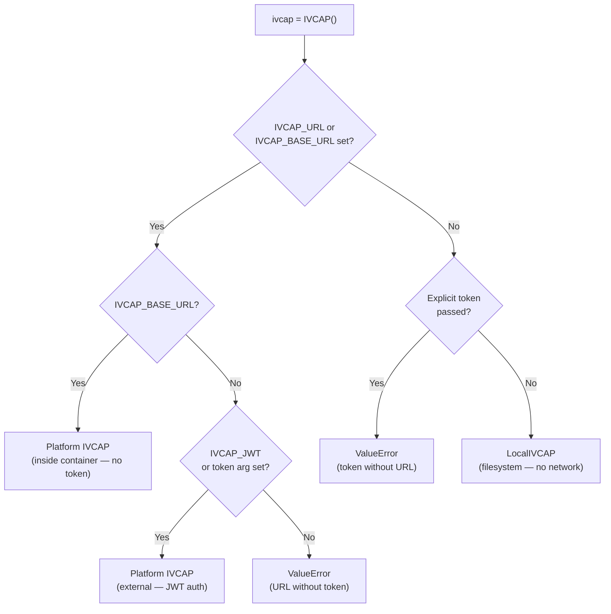

# Local Mode — Testing Services Without a Platform

This guide explains how to choose the right `IVCAP` instance for your situation and,
in particular, how to test an IVCAP service locally against real data before deploying
it to the platform.

---

## The Three Operating Modes

`ivcap_client` supports three distinct operating modes. The correct one is selected
**automatically** from environment variables, so the same `ivcap = IVCAP()` line works
everywhere.



| Mode | Typical use case | ENV vars needed |
|---|---|---|
| **Platform (external)** | Apps, scripts, notebooks accessing a live deployment | `IVCAP_URL` + `IVCAP_JWT` |
| **Platform (in-container)** | Code running inside an IVCAP job container | `IVCAP_BASE_URL` (injected by platform) |
| **Local** | Local development and service pre-deployment testing | None |

---

## Mode 1 — Platform (External Access)

**Typical users:** data engineers, researchers, and AI agents writing scripts that
orchestrate work on an IVCAP deployment — submitting jobs, uploading data, querying
results, and annotating artifacts.

```python
from dotenv import load_dotenv
from ivcap_client import IVCAP

# Load IVCAP_URL and IVCAP_JWT from a .dbg-env or .env file
load_dotenv(".dbg-env")

ivcap = IVCAP()  # → full platform IVCAP instance

# Discover services
for svc in ivcap.list_services(limit=10):
    print(svc)

# Upload data, run a job, retrieve results
import io, json, time
artifact = ivcap.upload_artifact(name="input.csv", file_path="/data/input.csv")
svc = ivcap.get_service_by_name("my-analysis")
job = svc.request_job(io.StringIO(json.dumps({"input": artifact.id})))
while not job.finished:
    time.sleep(5)
    job.refresh()
print(job.result)
```

**Credentials:** Set these in your environment or a `.env` file:

```
IVCAP_URL=https://api.your-ivcap-deployment.net
IVCAP_JWT=<token from: ivcap context get access-token>
```

See the [Authentication guide](../getting-started/authentication.md) for details.

---

## Mode 2 — Platform (Inside a Container)

**Typical users:** service code running inside an IVCAP job container — i.e. code you
have packaged with the [ivcap-service-sdk](https://pypi.org/project/ivcap_service/) and
deployed to the platform.

When a service container starts, the IVCAP platform automatically injects:

```
IVCAP_BASE_URL=http://ivcap.local   # the Service Sidecar URL
```

No JWT token is needed. `IVCAP()` picks this up automatically:

```python
from ivcap_client import IVCAP

ivcap = IVCAP()  # → platform IVCAP using the sidecar, no token required

# Reads and writes go through the sidecar, which handles auth and storage
artifact = ivcap.upload_artifact(name="result.nc", file_path="/tmp/result.nc")
ivcap.add_aspect(
    entity=artifact.id,
    aspect={"$schema": "urn:my:schema:result.1", "quality": 0.95},
)
```

This mode is fully transparent — the same code works in Mode 1 and Mode 2 without any
conditional logic.

---

## Mode 3 — Local Mode (No Platform Required)

**Typical users:** service developers who want to run and test their service logic
locally against real input files, *before* deploying to a platform.

When neither `IVCAP_URL` nor `IVCAP_BASE_URL` is set, `IVCAP()` automatically returns
a **`LocalIVCAP`** instance — a filesystem-backed subclass of `IVCAP` that stores
artifacts and aspects under a local directory. No network calls are made.

```python
from ivcap_client import IVCAP

ivcap = IVCAP()  # → LocalIVCAP (no URL env vars set)

# Works exactly like the platform version
artifact = ivcap.upload_artifact(name="result.csv", file_path="/tmp/result.csv")
print(artifact.id)
# urn:file:///abs/path/to/ivcap-artifacts/artifacts/result.csv

aspect = ivcap.add_aspect(
    entity=artifact.id,
    aspect={"$schema": "urn:my:schema:tag.1", "label": "test"},
)
print(aspect.id)
# urn:ivcap:aspect:<uuid>
```

### Local directory layout

All data is stored under `base_dir` (default: `ivcap-artifacts` in the current
working directory):

```
ivcap-artifacts/
  artifacts/          ← files written by upload_artifact()
    result.csv
    deep/nested/file.nc
  aspects/            ← JSON files written by add_aspect() / update_aspect()
    <uuid>.json
    <uuid>.json
```

### Configuring the base directory

In order of priority (highest first):

1. **Explicit argument** to `LocalIVCAP()` or `IVCAP.local()`:
   ```python
   ivcap = IVCAP.local(base_dir="./my-test-output")
   ```
2. **`IVCAP_LOCAL_DIR` environment variable:**
   ```bash
   export IVCAP_LOCAL_DIR=./test-output
   python my_service.py
   ```
3. **Default:** `ivcap-artifacts` (relative to the current working directory)

### Forcing local mode in tests

Use `IVCAP.local()` or construct `LocalIVCAP` directly to guarantee local mode
regardless of which environment variables happen to be set — useful in unit tests:

```python
import pytest
from ivcap_client import IVCAP, LocalIVCAP

@pytest.fixture
def ivcap(tmp_path):
    """Always returns a LocalIVCAP backed by a fresh temp directory."""
    return IVCAP.local(base_dir=tmp_path / "artifacts")

def test_my_service(ivcap, tmp_path):
    # Prepare a test input file
    src = tmp_path / "input.csv"
    src.write_text("a,b\n1,2\n")

    # Run service logic that calls ivcap.upload_artifact / ivcap.add_aspect
    artifact = ivcap.upload_artifact(name="input.csv", file_path=str(src))
    assert artifact.id.startswith("urn:file://")

    # Confirm the file landed in the right place
    from pathlib import Path
    dest = Path(artifact.id[len("urn:file://"):])
    assert dest.exists()
```

### What `LocalIVCAP` supports

`LocalIVCAP` is a **subclass of `IVCAP`** and covers the operations needed to run and
test service logic locally:

**Artifacts**

| Method | Local behaviour |
|---|---|
| `upload_artifact(name, file_path, ...)` | Copies source file to `base_dir/artifacts/<name>` |
| `upload_artifact(name, io_stream, ...)` | Writes stream bytes/text to `base_dir/artifacts/<name>` |
| `get_artifact("urn:file://..." or "file://...")` | Returns a `LocalFileArtifact` for an existing local file |
| `collection`, `policy`, `chunk_size`, `retries` args | Accepted for API compatibility; silently ignored |

**Aspects** (stored as JSON files under `base_dir/aspects/`)

| Method | Local behaviour |
|---|---|
| `add_aspect(entity, aspect, *, schema)` | Writes `<uuid>.json`; returns a `LocalAspect` |
| `update_aspect(entity, aspect, *, schema)` | Same as `add_aspect` (no retraction in local mode) |
| `get_aspect(aspect_id)` | Reads the JSON file by full URN or bare UUID |
| `list_aspects(entity, schema, limit)` | Scans `aspects/` directory; supports `entity`, `schema`, and `limit` filters |

> **Note:** Methods that require a live platform connection (`list_services`,
> `list_orders`, `list_artifacts`, `search`, etc.) are not overridden and will raise
> `AttributeError` if called on a `LocalIVCAP` instance, since the underlying
> `_client` attribute is not set.

### Detecting the active mode at runtime

```python
from ivcap_client import IVCAP, LocalIVCAP

ivcap = IVCAP()

if isinstance(ivcap, LocalIVCAP):
    print(f"Local mode — artifacts under: {ivcap.base_dir}")
else:
    print(f"Platform mode — connected to: {ivcap.url}")
```

---

## Writing Code That Works in All Three Modes

The central design goal is that **your service code needs zero conditional logic**.
Use `IVCAP()` everywhere and the right implementation is injected by environment:

```python
# my_service.py — works locally AND on the platform unchanged
from ivcap_client import IVCAP

def run(input_file: str) -> None:
    ivcap = IVCAP()  # LocalIVCAP locally, platform IVCAP when deployed

    # Upload result
    artifact = ivcap.upload_artifact(name="output.nc", file_path=input_file)

    # Annotate result
    ivcap.add_aspect(
        entity=artifact.id,
        aspect={
            "$schema": "urn:my-project:schema:result-summary.1",
            "source_file": input_file,
            "rows": 1234,
        },
    )
    print(f"Result artifact: {artifact.id}")
```

**To run locally:**

```bash
# No IVCAP_URL set → LocalIVCAP
python my_service.py input.csv
# Result artifact: urn:file:///abs/path/to/ivcap-artifacts/artifacts/output.nc
```

**To run on the platform:**

```bash
# IVCAP_BASE_URL injected by sidecar → platform IVCAP
python my_service.py input.csv
# Result artifact: urn:ivcap:artifact:<uuid>
```

---

## See Also

- [Working with Artifacts](artifacts.md) — Full artifact API reference
- [The Datafabric & Aspects](aspects.md) — Aspect add / update / query
- [Authentication](../getting-started/authentication.md) — Platform credentials setup
- [Environment Variables](../reference/environment-variables.md) — All config variables
